# How to read this document

This document is using Mermaid plugin to define diagrams. The easiest way to view such diagrams is to access README from github, which automatically renders Mermaid diagrams in place.
Another way is to copy-past the content into https://stackedit.io

# Architecture Diagrams

## Use case diagram:

Use case diagram shows use cases of the system

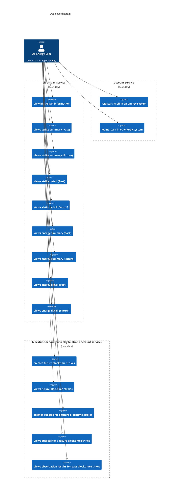

## Highlevel overview of Op-Energy

This diagram shows high level overview of Op-Energy system

NOTE: email notification service is present, but not implemented yet

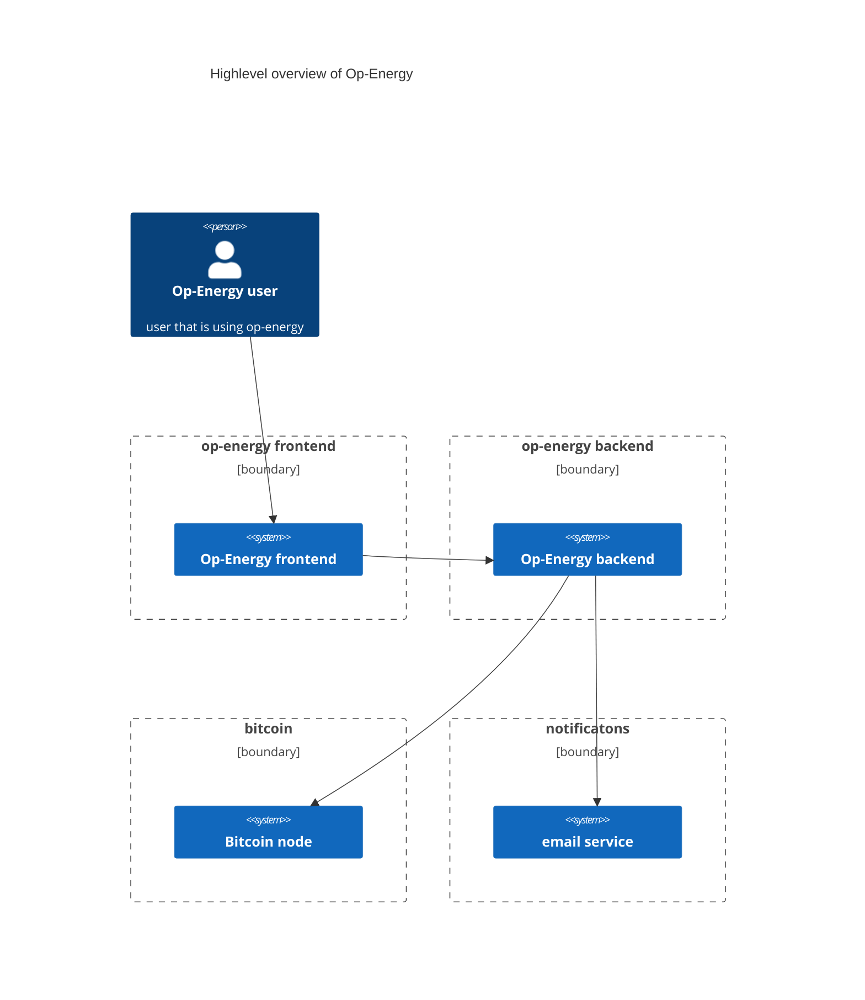

## Backend view of component diagram

This part describes backend-centric components diagram

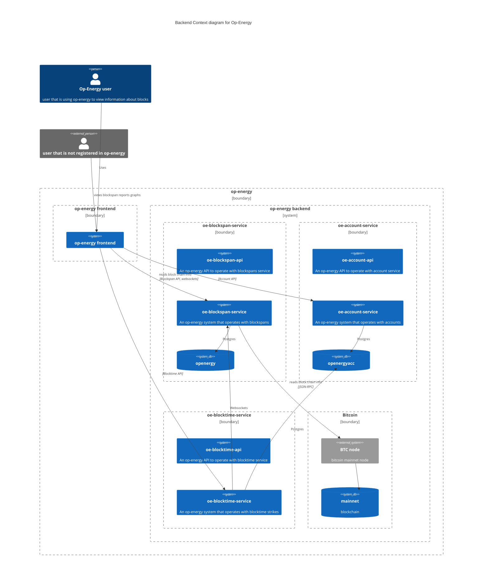

## Frontend view of component diagram

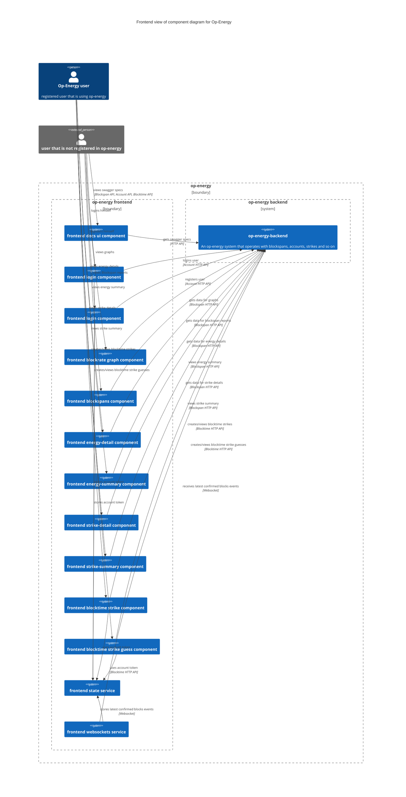

## GIT repos diagram

This part contains diagram of git repositories being used in op-energy.
It should be noted that:
1. the entry point of API libraries are usually `$GIT_REPO/src/Data/OpEnergy/$SERVICE/API.hs`. This module defines prefix route (for example, `/api/v1/account/`) and then includes modules, that defines subroutes (for example, module `$GIT_REPO/src/Data/OpEnergy/Account/API/V1.hs` defines subroutes `register` and `login` and thus `/api/v1/account/register` and `/api/v1/account/login` are being defined). Each such library add `/api/v1/$SERVICE/swagger.json` handler, such that implementations should serve swagger spec of appropriate API. Each API library can be built as binary, which  just outputs Swagger API spec in json format;
2. each service, that implements appropriate API, are binary executables and their entrypoint is `$GIT_REPO/app/Main.hs`, which calls Servant library. But, all the services share some servicing part and thus function `$GIT_REPO/src/OpEnergy/$SERVICE/Server.hs/runServer` can be assumed as a real entrypoint of an appropriate service. This module includes subsequent modules that implement appropriate APIs;
3. for a sake of simplicity, currently Account API, Blocktime API are merged into 1 library;
4. for a sake of simplicity, currently Account Service and Blocktime Service are merged into 1 library;
5. Swagger specs are being generated automatically from API specificatons by using servant-swagger library. Check `https://docs.servant.dev/en/stable/tutorial/ApiType.html` for a tutorial of how to define API.

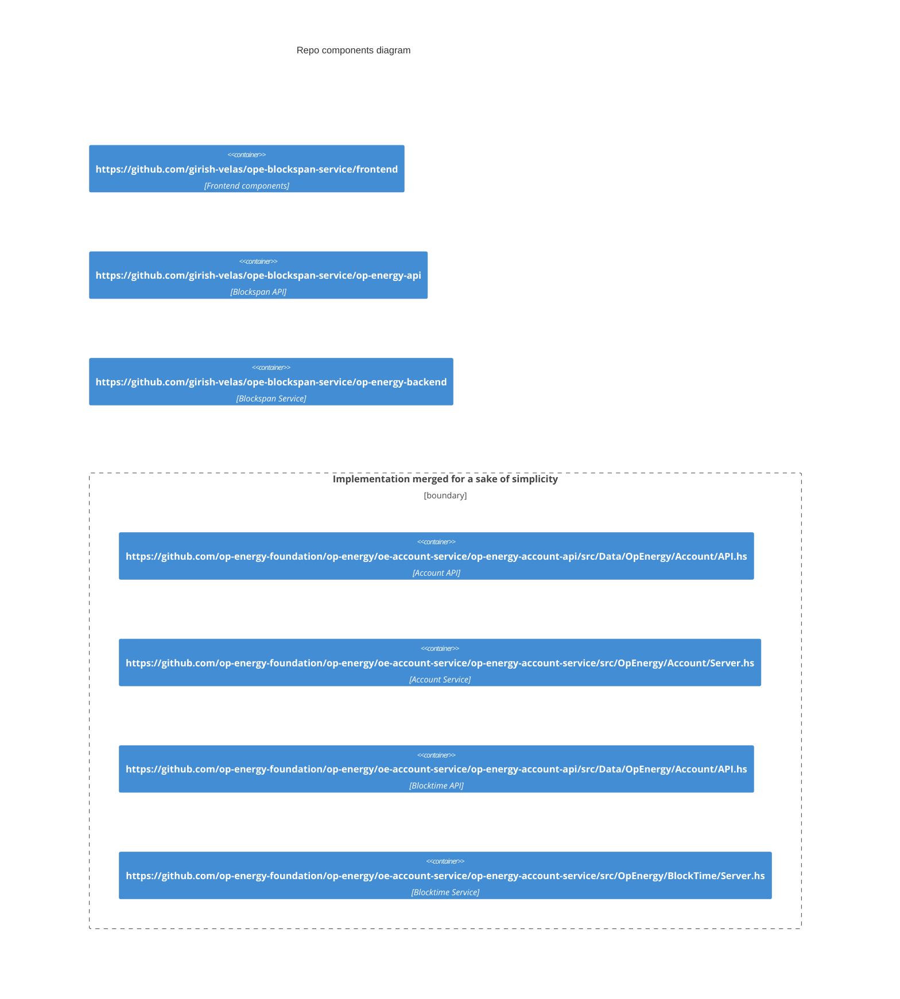

## Sequence diagrams

### bootstrap sequence

This diagram shows starting up process of op-energy

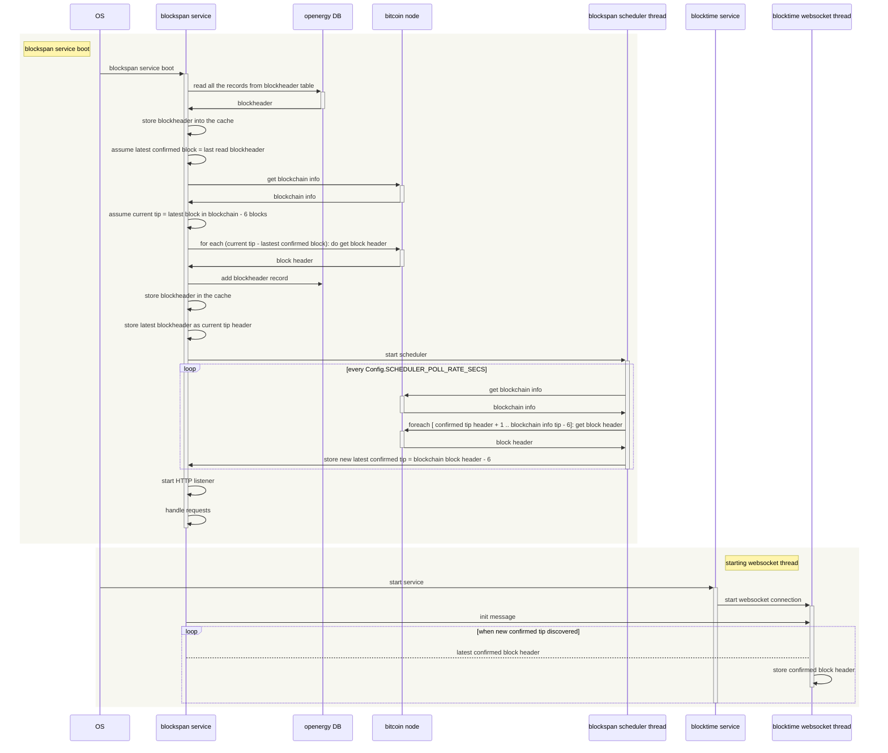

###  blockspan reports or graphs

This diagram shows the process of blockspan reports or graphs

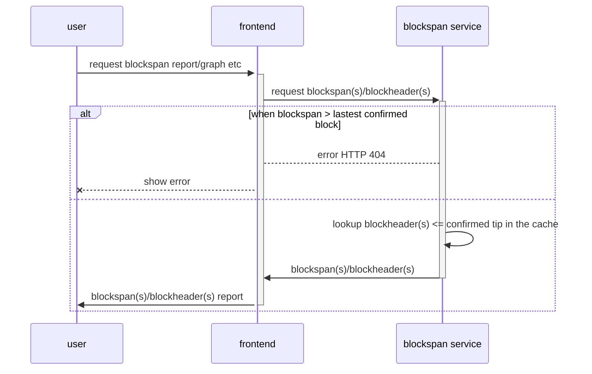
###  user registration

This diagram shows the process of user registration

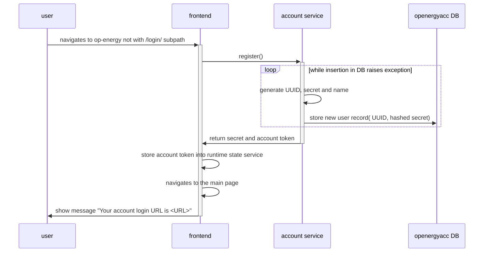

###  user login

This diagram shows the process of user login

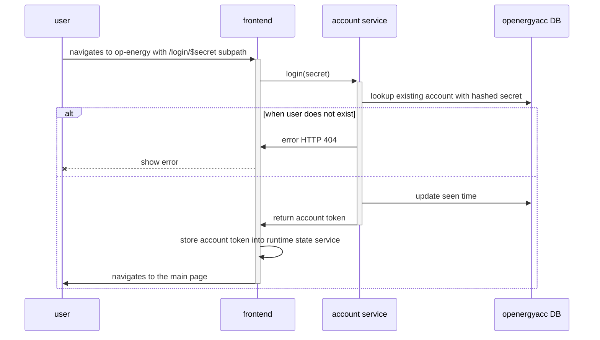

###  block time strike creation

This diagram shows the process of block time strike creation

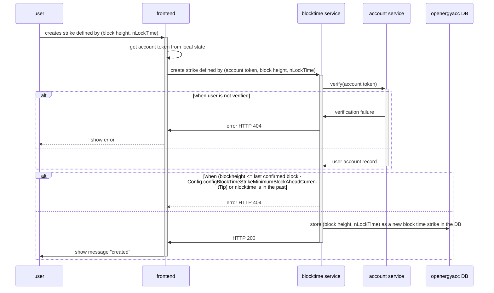

### automatic future block time strike creation

Blocktime service provides automaticall creation of future strikes during handling latest confirmed block event. See oe-account-service/op-energy-account-service/src/OpEnergy/BlockTimeStrike/Server/V1/BlockTimeScheduledFutureStrikeCreation.hs for implementation. Current implementation ensures, that there are future strike exist in range `[ minimumFutureStrikeHeight, maximumFutureStrikeHeight]`, where:

```haskell
  minimumFutureStrikeHeight = blockHeaderHeight currentTip + configBlockTimeStrikeFutureGuessMinimumBlockAheadCurrentTip
  maximumFutureStrikeHeight = blockHeaderHeight currentTip + configBlockTimeFutureStrikeShouldExistsAheadCurrentTip
```

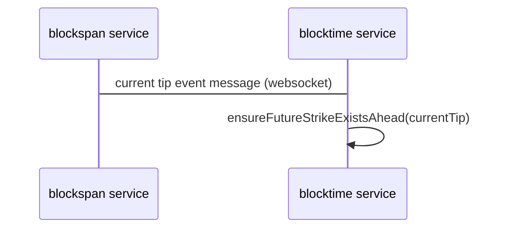

### viewing list of block time strikes

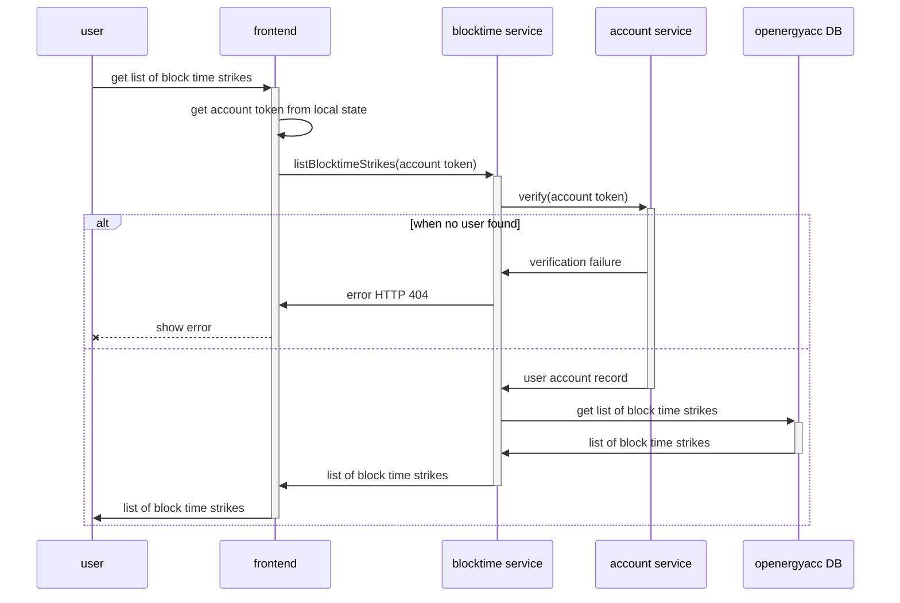

### create block time strike's guess

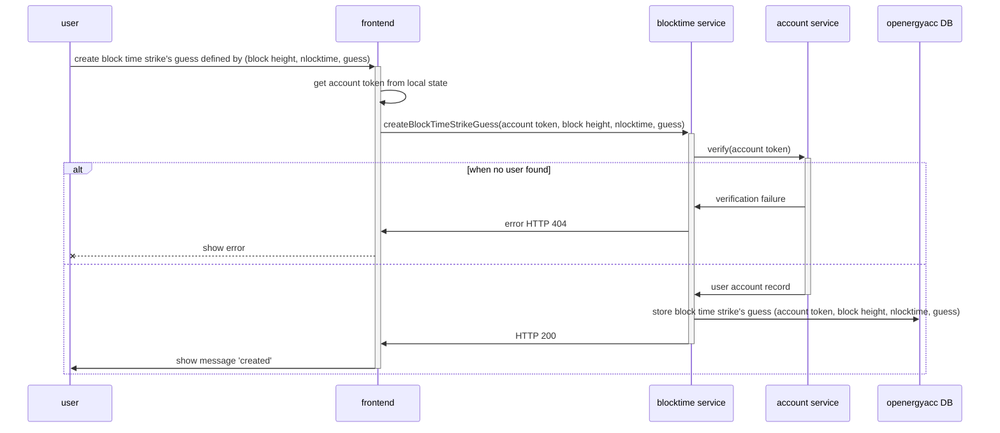

# Implementation details

This section containes some implementation details, that were considered as important enough to note

## Blockspan service

### BlockHeader cache

Blockspan service implements immutable cache of the BlockHeaders for the whole block chain. It's purpose is to provide constant access to any BlockHeader.
On a high level overview, this cache is implemented as IOVector( Compact( Vector BlockHeader)) and thus:
1. implementation provides constant access time;
2. reduces load on garbage collector by using Compact regions.
You can check implementation in $ope-blockspan-repo/op-energy-backend/src/OpEnergy/Server/V1/BlockHeadersService/Vector/Cache.hs

## Op-energy account service

1. AccountToken's payload is currently implemented as tuple (uuid, loginsCount) encoded into JSON then encryped with AES (see Web.ClientSession from clientsession library) and then encoded into base64 form. Where:
 - uuid is of type UUID Person, which is unique string;
 - loginsCount - is of type Word64 and it is a monotonically increasing integer.
The reasoning behind such payload content is that it allowes us to consider AccountTokens to be valid only when loginsCount in the token matches loginsCounts field in DB record. It is supposed, that loginsCount DB record field will
l be updated each time user logins in with 'login' API call.
This way we are able to ensure, that:
2. each user will get unique tokens within a range of [ 0; MAX Word64 value ];
3. only 1 unique token is assumed to be valid;
4. there is no possibility to use old leaked token to access any users other than owner of such token;
5. when user will overflow MAX Word64 value of logins counts, he will start to get repeating tokens

Current AccountToken implementation's goal is to address those attack vectors:
1. secret leak. reduced possibility of leak by requiring it only once for login;
2. token leak. reduced damage by invalidating previous tokens at each new login;
3. using tokens to access other users accounts. Tokens are only valid for an owner of the token.
4. token modification. In order to modify token, an attacker should know encryption key which is being used by backend.

## Configuration files

Each service has configuration file. You can define path to a config by using appropriate environment variables:
- blockspan service: "OPENERGY_BACKEND_CONFIG_FILE";
- account service: "OPENERGY_ACCOUNT_SERVICE_CONFIG_FILE";

blocktime service now is a part of account service and thus it shares account service's environment variable for configuration file.

Configuration options defined in:
- blockspan service: ope-blockspan-service/op-energy-backend/src/OpEnergy/Server/V1/Config.hs;
- account service: op-energy/oe-account-service/op-energy-account-service/src/OpEnergy/Account/Server/V1/Config.hs.

