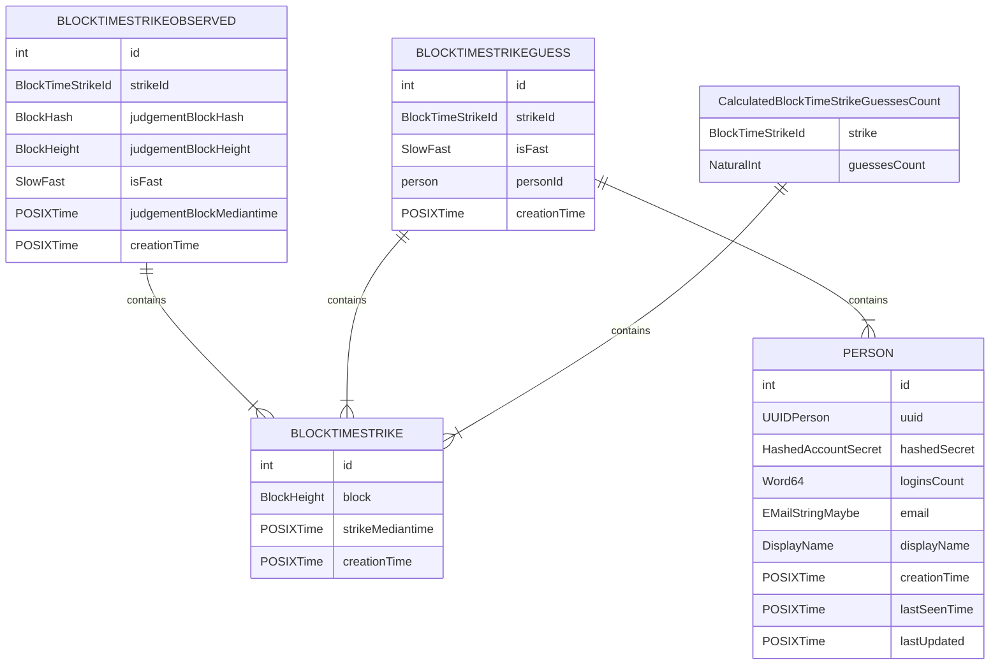

# Block time strike service

## DB Schema

DB Schema is now a part of API library because until a certain point it was easier to use record data types directly in the API. It could be changed in the future, when we will decide that DB schema model is an implementation detail and should be moved to the appropriate implementation of the service.

Ideally, the source of the DB schema should be read from schema description in:
- https://github.com/op-energy-foundation/op-energy/blob/17-improve-immutability-of-data/oe-account-service/op-energy-account-api/src/Data/OpEnergy/Account/API/V1/BlockTimeStrike.hs#L50-L84
- https://github.com/op-energy-foundation/op-energy/blob/17-improve-immutability-of-data/oe-account-service/op-energy-account-api/src/Data/OpEnergy/Account/API/V1/BlockTimeStrikeGuess.hs#L51-L72
- (reference to Person table from Account service): https://github.com/op-energy-foundation/op-energy/blob/17-improve-immutability-of-data/oe-account-service/op-energy-account-api/src/Data/OpEnergy/Account/API/V1/Account.hs#L192-L209

as the descriptions is the closest one to an actual data model and it is implemented as more or less compact and includes references between tables and their constraints

But, if you need a quick overview and have some issues with representing schema in your head, there is a diagram of current schema:
(but keep in mind, that in the worst case it won't be updated asap, but expected to be updated during Schema change)

